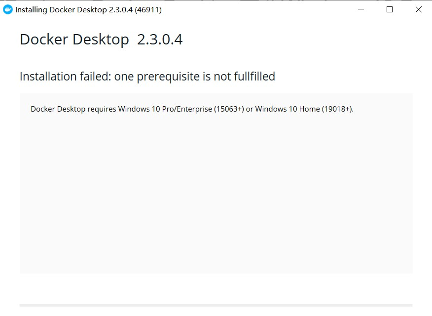

Docker 官网：https://docs.docker.com/

## 安装 Docker

### Mac Docker

- 按照官方教程（https://docs.docker.com/docker-for-mac/install/）下载.dmg并安装使用
- 设置国内镜像https://docker.mirrors.ustc.edu.cn/，设置完要重启Docker（教程在这里：http://guide.daocloud.io/dcs/daocloud-9153151.html#Docker%E5%8A%A0%E9%80%9F%E5%99%A8-DockerforMac）
- 默认需要注册才可以下载（注册地址：https://hub.docker.com/）

### Windows Docker

- 注册地址：https://hub.docker.com/
- 下载 Docker Desktop （地址：https://docs.docker.com/docker-for-windows/install/）
- 下载 Docker for Windows Installer(需要登录)（下载地址：https://docs.docker.com/docker-for-windows/）
- 确保下载成功，即 docker --version 返回版本号
- 设置国内镜像https://docker.mirrors.ustc.edu.cn/，设置完要重启Docker（教程在这里：http://guide.daocloud.io/dcs/daocloud-9153151.html
- 确保 docker run hello-world 输出 Hello from Docker!
- 如果因为 Hyper-V 等原因无法安装新版，可以考虑旧版 Docker

### Windows 安装旧版 Docker

- 搜索 Docker (找到 Docker Quickstart Terminal 并打开)
- Docker Quickstart Terminal 会启动一个 Oracle VM VirtualBox 的虚拟机（虚拟机用来运行 docker）
- Docker Quickstart 运行后看到一个 IP，使用 docker-machine ip 可得到 IP
- 新开命令行，运行 docker -v
- 设置国内镜像https://docker.mirrors.ustc.edu.cn/，设置完要重启Docker（教程在这里：http://guide.daocloud.io/dcs/daocloud-9153151.html
- 运行 docker run hello-world

## Docker 安装 MySQL（https://hub.docker.com/_/mysql）

```
docker run --name some-mysql -e MYSQL_ROOT_PASSWORD=my-secret-pw -d mysql:tag  // 官方命令
docker run --name mysql -e MYSQL_ROOT_PASSWORD=123456 -p 3306:3306 -d mysql:5.7.27  // 测试命令
```

- 使用 5.7.27 版本或者 8.0.18
- 使用 `docker run`命令启动容器
- name 是容器（数据库）的名字
- -e 环境变量（MYSQL_ROOT_PASSWORD 是要设置的密码）
- -d 守护进程（持续运行，不会被系统关闭）
- :tag 要装的 MySQL 的版本
- -p 3306:3306 端口映射

### 常用的 Docker 命令

- 命令
  - `docker ps` 查看容器运行状态
  - `docker kill mysql1`关闭容器
  - `docker container run mysql1`开启刚关闭的容器
  - `docker rm mysql1`删掉容器，必要时可加-f 选项
  - `docker run` 运行新容器

* 注意
  - 用 Docker 运行的容器，默认不会持久化
  - 不会持久化是指如果容器被删除了，那么数据也没有了
  - 如果需要持久化，搜索 docker mysql 数据目录

### 用命令行连接 mysql

- Docker exec 命令
  - docker exec -i mysql1 bash
  - 输入这行命令会进入容器，容器里有一个 Linux 系统
  - 然后就可以在这个系统里运行 mysql
- mysql 命令
  - `mysql -u root -p` 回车，然后输入密码 123456
  - `show databases;`可查看数据库列表（没有加分号就回车的话，使用 ctrl+c 重来）
  - `use xxx;`可选择使用 xxx 数据库
  - `use sys;`使用默认的 sys 数据库
  - `show tables;`查看所有表
  - `select * from CHARACTER_SETS;`查看表内容

### Docker Desktop Installer 安装 Docker 失败

- 错误信息：Docker Desktop requires Windows 10 Pro/Enterprise (15063+) or Windows 10 Home (19018+).



- 错误原因：Docker Desktop 使用需要 Windows 10 Pro 或 Enterprise，而我使用的 windows 10 家庭版，至少需要专业版才可以直接支持 Docker Desktop
- 解决方案：https://www.sitepoint.com/docker-windows-10-home/

### 如何在 Windows 家庭版安装 Docker

- 安装 Git Bash
- 安装 Chocolatey，这是 Windows 的软件包管理器。这将使安装其余程序的工作更加容易。
- 安装 VirtualBox 及其扩展名。另外，如果您已完成 Chocolatey 的安装，则只需在提升的 PowerShell 终端中执行以下命令`choco install virtualbox`
- 安装 Docker Machine，在 PowerShell 执行如下命令`choco install docker-machine`
- 在 Git Bash 终端上，使用 Docker Machine 安装 Docker Engine。这将下载包含 Docker Engine 的 Linux 映像，并使用 VirtualBox 将其作为 VM 运行。`docker-machine create --driver virtualbox默认`

### Docker
