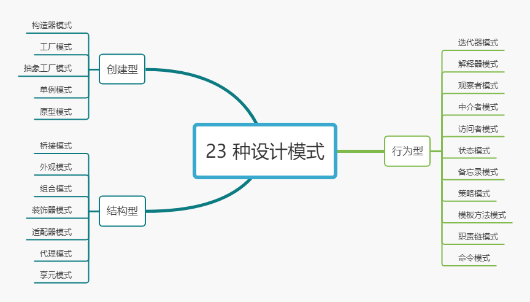
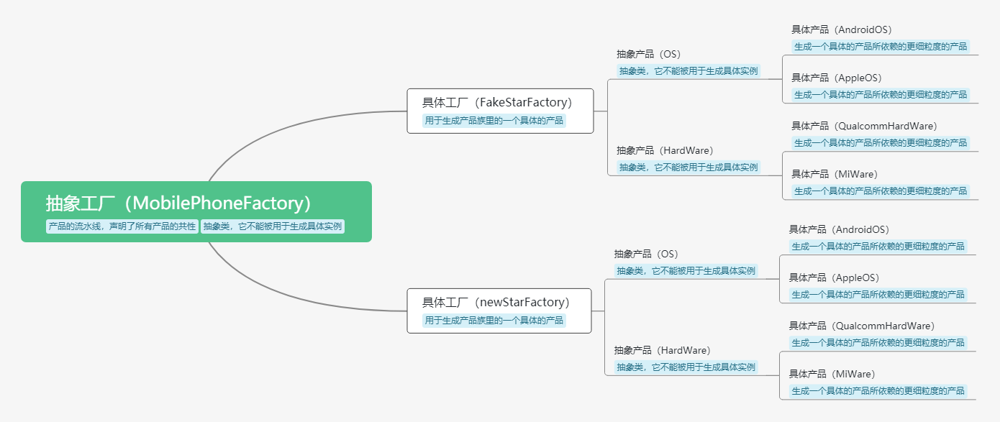

## 前言
【JavaScript设计模式】是我阅读掘金小册 [JavaScript 设计模式核⼼原理与应⽤实践](https://juejin.cn/book/6844733790204461070) 后获得的收获。JavaScript设计模式大致可以分为三类，**创建型**，**结构型**，**行为型**，我也会按照这样的顺序进行学习并写文章记录。     
```js
1. 创建型模式封装了创建对象过程中的变化，它做的事情就是`将创建对象的过程抽离`
2. 结构型模式封装的是`对象之间组合方式的变化`，目的在于灵活地表达对象间的配合与依赖关系   
3. 行为型模式则是`将对象千变万化的行为进行抽离`，确保我们能够更安全、更方便地对行为进行更改
```
> 面试官常常会问：你知道哪些设计模式？有没有在实战中使用过？看完这个系列，你就可以在面试官侃侃而谈。

设计模式的基本原则：**软件实体（类、模块、函数）可以扩展，但是不可修改**。

本文是这个系列的第一篇文章，主要学习的是工厂模式，将按照从易到难的顺序，从**构造器模式**到**简单工厂模式**，再到**抽象工厂模式**进行学习。

## 设计模式
### 为什么会出现设计模式？   
我们开发一个业务，随着业务的不断迭代和扩展，代码量会变得无比庞大，逻辑也会变得非常复杂。这一点相信大家在工作中已经深有体会，如果不使用一些方法进行控制，那么最终会变得无法维护并且不可扩展。  

而设计模式就是用来解决这些问题的，设计模式通过**将变与不变分离，确保变化的部分灵活、不变的部分稳定**，来帮助我们写出“健壮”的代码，保证代码的可扩展性和高维护性。
### JavaScript 设计模式的原则
在JavaScript 设计模式中，主要用到的设计模式基本都围绕“**单一功能**”和“**开放封闭**”这两个原则来展开。接下来让我们了解一下这两个原则在设计模式中的实践。


## 构造器模式 
需求：录入新员工信息

这个模式大家是非常熟悉的，我们平时使用的构造函数就是应用了构造器模式。    
像 User 这样当新建对象的内存被分配后，用来`初始化该对象`的特殊函数，就叫做**构造器**。 

```js
function User(name , age, career) {
    this.name = name
    this.age = age
    this.career = career 
}
```

在使用构造器模式的时候，我们本质上是去抽象了每个对象实例的`变与不变`。每个对象都具备 `name` 、`age`、`career`这些属性，是不变的；而name、age、career 各自的值是不同的，这是变化的。

> 构造器模式和构造函数的命名是非常类似的，那么到底是先有了构造器模式，才有了构造函数，还是有了构造函数之后才有了构造器的模式。这个问题就像是先有鸡还是先有蛋的问题，谜底是什么我们不得而知，有兴趣的小伙伴可以自己去探索一下。

构造器模式和工厂模式本质还是相同的。**构造器模式解决的是多个对象实例的问题，工厂模式解决的是多个类的问题。** 构造器处理的是对象实例的变与不变，工厂模式处理的是构造函数的变与不变。   


## 工厂模式

需求：为不同的工种添加不同的职能

工厂模式其实就是**将创建对象的过程单独封装**。使用工厂模式时，我们要做的就是去抽象不同构造函数（类）之间的**变与不变**。

**应用场景**：在使用构造函数的地方，我们就应该想到工厂模式；在写了**大量构造函数**、调用了**大量的 `new`** 的时候。


```js
function User(name , age, career, work) {
  this.name = name
  this.age = age
  this.career = career 
  this.work = work
}

function Factory(name, age, career) {
  let work
  switch(career) {
    case 'coder':
      work =  ['写代码','写系分', '修Bug'] 
      break
    case 'product manager':
      work = ['订会议室', '写PRD', '催更']
      break
    case 'boss':
      work = ['喝茶', '看报', '见客户']
    case 'xxx':
      // 其它工种的职责分配
      ...

      return new User(name, age, career, work)
  }

```

使用工厂模式 1.0 写出来的代码依然有局限性，随着业务的推移，员工职责可能会频繁变动和修改，那么频繁在这里进行改动对于整个团队都是不友好的。   

这个时候就需要用到工厂模式 2.0 了，把每个不同的模块都独立出来，各自负责自己的功能，互不影响。这样就可以保证软件的高扩展性和可维护性。

### 抽象工厂模式

这里强烈推荐掘金小册中的 [抽象工厂模式](https://juejin.cn/book/6844733790204461070/section/6844733790263197710)，这一章写的实在太好了，推荐大家去看一下。下面我直接借用了作者的例子。这个例子的篇幅有点长，希望大家可以耐心看完，相信会对你有所帮助。



> 大家可以结合我画的这幅图进行阅读，更便于理解

大家知道一部智能手机的基本组成是操作系统（OS）和硬件（HardWare）组成。假设我们现在是一个手机厂商，那么我们就需要有生产操作系统的厂商和生产硬件的厂商，才可以量产手机。

```js
class MobilePhoneFactory {
  // 提供操作系统的接口
  createOS() {
    throw new Error("抽象工厂方法不允许直接调用，你需要将我重写！");
  }
  // 提供硬件的接口
  createHardWare() {
    throw new Error("抽象工厂方法不允许直接调用，你需要将我重写！");
  }
}
```
上面这个类的功能只有一个，就是约定手机流水线的通用能力。如果你想要 new 一个 `MobilePhoneFactory` 实例，并尝试调用它的实例方法，它会提醒你“我是 Boss，不是让你用来 new 一个实例的”。在抽象工厂模式里，上面这个类就处于我们食物链最顶端的位置，我们称之为 `AbstractFactory`（**抽象工厂**）。

说完抽象工厂，再来说一下抽象工厂的下游——**具体工厂**（`ConcreteFactory`）。抽象工厂已经规划好了公司的流水线，那么具体工厂就是用来实现具体的功能，生成各自的软件和硬件。比如我现在想要一个专门生产 Android 系统 + 高通硬件的手机的生产线，我们给这类手机型号起名叫 FakeStar，那我就可以为 FakeStar 定制一个具体工厂：

```js
// 具体工厂继承自抽象工厂
class FakeStarFactory extends MobilePhoneFactory {
    createOS() {
        // 提供安卓系统实例
        return new AndroidOS()
    }
    createHardWare() {
        // 提供高通硬件实例
        return new QualcommHardWare()
    }
}
```
这里我们的 FakeStar 工厂调用了两个构造函数：AndroidOS 和 QualcommHardWare，它们分别用于生成具体的操作系统和硬件实例。像这种被我们拿来用于 new 出具体对象的类，叫做**具体产品类**（`ConcreteProduct`）。具体产品类往往不会孤立存在，不同的具体产品类往往有着共同的功能，比如安卓系统类和苹果系统类，它们都是操作系统，都有可以**操控手机硬件系统**基本的功能。因此我们可以用一个**抽象产品（`AbstractProduct`）类**来声明这一类产品应该具有的基本功能。（这里的具体产品类和抽象产品类也是这个设计模式的一部分，下文会有解释的）
```js
// 定义操作系统这类产品的抽象产品类
class OS {
    controlHardWare() {
        throw new Error('抽象产品方法不允许直接调用，你需要将我重写！');
    }
}
// 定义具体操作系统的具体产品类
class AndroidOS extends OS {
    controlHardWare() {
        console.log('我会用安卓的方式去操作硬件')
    }
}

class AppleOS extends OS {
    controlHardWare() {
        console.log('我会用🍎的方式去操作硬件')
    }
}

// 定义手机硬件这类产品的抽象产品类
class HardWare {
    // 手机硬件的共性方法，这里提取了“根据命令运转”这个共性
    operateByOrder() {
        throw new Error('抽象产品方法不允许直接调用，你需要将我重写！');
    }
}
```

硬件类产品同理：
```js
// 定义具体硬件的具体产品类
class QualcommHardWare extends HardWare {
    operateByOrder() {
        console.log('我会用高通的方式去运转')
    }
}

class MiWare extends HardWare {
    operateByOrder() {
        console.log('我会用小米的方式去运转')
    }
}
```

好了，手机流水线和软件硬件都准备好了，当我们需要生产一台FakeStar手机时，只需要这样做：
```js
// 这是我的手机
const myPhone = new FakeStarFactory()
// 让它拥有操作系统
const myOS = myPhone.createOS()
// 让它拥有硬件
const myHardWare = myPhone.createHardWare()
// 启动操作系统(输出‘我会用安卓的方式去操作硬件’)
myOS.controlHardWare()
// 唤醒硬件(输出‘我会用高通的方式去运转’)
myHardWare.operateByOrder()
```

关键时刻来了——假如有一天，FakeStar过气了，我们需要生产一款新机投入市场，这时候我们**不需要对抽象工厂MobilePhoneFactory做任何修改**，只需要拓展一条新的手机生产线即可。
```js
class newStarFactory extends MobilePhoneFactory {
  createOS() {
    // 操作系统实现代码
  }
  createHardWare() {
    // 硬件实现代码
  }
}
```
我们新的流水线**对原有的系统不会造成任何潜在影响**，所谓的“对拓展开放，对修改封闭”就这么圆满实现了。前面我们之所以要实现**抽象产品类**，也是同样的道理。


## 总结
同样是工厂模式，抽象工厂和简单工厂的思路有哪些异同呢？

两者的共同点，在于都**尝试去分离一个系统中变与不变的部分**。它们的不同在于**应用场景的复杂度**。  
* 在简单工厂的使用场景里，处理的对象是一些逻辑简单，共性明显的类，故而不必苛求代码可扩展性。  
* 但在抽象工厂是用来处理那些逻辑复杂，并且有很多种扩展性可能性的类，复杂多变的场景使得我们必须对**共性**作更特别的处理、使用抽象类去降低扩展的成本，同时需要对类的性质作划分。

所以抽象工厂模式就有了这样的四个关键角色：

-   **抽象工厂（抽象类，它不能被用于生成具体实例）：**  用于声明最终目标产品的共性。在一个系统里，抽象工厂可以有多个（大家可以想象我们的手机厂后来被一个更大的厂收购了，这个厂里除了手机抽象类，还有平板、游戏机抽象类等等），每一个抽象工厂对应的这一类的产品，被称为“产品族”。
-   **具体工厂（用于生成产品族里的一个具体的产品）：**  继承自抽象工厂、实现了抽象工厂里声明的那些方法，用于创建具体的产品的类。
-   **抽象产品（抽象类，它不能被用于生成具体实例）：**  上面我们看到，具体工厂里实现的接口，会依赖一些类，这些类对应到各种各样的具体的细粒度产品（比如操作系统、硬件等），这些具体产品类的共性各自抽离，便对应到了各自的抽象产品类。
-   **具体产品（用于生成产品族里的一个具体的产品所依赖的更细粒度的产品）：**  比如我们上文中具体的一种操作系统、或具体的一种硬件等。


学习设计模式也跟使用抽象工厂模式一样，当前对于我们的提升可能并不是很大；但是等到我们负责的业务越来越复杂，接手的工作也越来越多的时候，设计模式的重要性就会逐渐凸显出来。（怎么听起来像画饼？？？人只愿意相信自己愿意相信的东西，我相信学习设计模式会对我以后的职业生涯有所帮助，所以我就学习了）