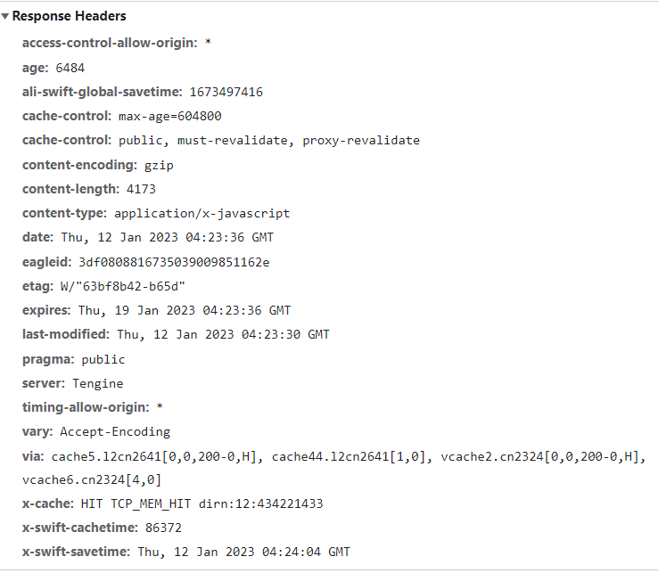
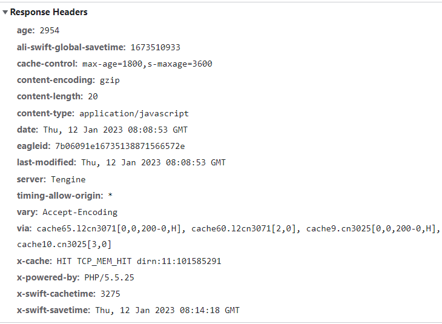

缓存可以减少网络 IO 消耗，提高访问速度。浏览器缓存是一种操作简单、效果显著的前端性能优化手段

Chrome 官方给出的解释：

> 通过网络获取内容既速度缓慢又开销巨大。较大的响应需要在客户端与服务器之间进行多次往返通信，这会延迟浏览器获得和处理内容的时间，还会增加访问者的流量费用。因此，缓存并重复利用之前获取的资源的能力成为性能优化的一个关键方面。

## 浏览器请求资源优先级

浏览器缓存机制有四个方面，它们按照获取资源时请求的优先级依次排列如下：

1. Memory Cache （浏览器内存缓存）
2. Service Worker Cache （Service Worker 缓存）
3. HTTP Cache （HTTP 缓存）
4. Push Cache （）

我们先来看一下线上网站的 Network 面板的截图：
[](https://p1-jj.byteimg.com/tos-cn-i-t2oaga2asx/gold-user-assets/2018/9/20/165f715425bd73b6~tplv-t2oaga2asx-zoom-in-crop-mark:3024:0:0:0.awebp)

大家注意一下非数字——即形如“（from xxx）”这样的描述——对应的资源，这些资源就是我们通过缓存获取到的。其中，“from memory cache”对标到 Memory Cache 类型，“from ServiceWorker”对标到 Service Worker Cache 类型。至于 Push Cache，这个比较特殊，是 HTTP2 的新特性。

下面我们将从这四个方面一一介绍，考虑到 HTTP 缓存是最主要、最具有代表性的缓存策略，也是每一位前端工程师都应该深刻理解掌握的性能优化知识点，我们首先学习 HTTP 缓存。

## HTTP 缓存机制

HTTP 缓存是我们日常开发中最为熟悉的一种缓存机制。它又分为强缓存和协商缓存。优先级较高的是强缓存，在命中强缓存失败的情况下，才会走协商缓存。

### 强缓存

强缓存是利用 http 头中的 Expires 和 Cache-Control 两个字段来控制的。强缓存中，当请求再次发出时，浏览器会根据其中的 expires 和 cache-control 判断目标资源是否“命中”强缓存，若命中则直接从缓存中获取资源，不会再与服务端发生通信。

命中强缓存的情况下，返回的 HTTP 状态码为 200

#### expires

实现强缓存，过去我们一直用 expires。
当服务器返回响应时，在 Response Headers 中将过期时间写入 expires 字段。像这样：


在上面的截图中，expires 是长这样的：

```js
expires: Thu, 19 Jan 2023 04:23:36 GMT
```

expires 是一个时间戳，接下来如果我们试图再次向服务器请求资源，浏览器就会先对比本地时间和 expires 的时间戳，如果本地时间小于 expires 设定的过期时间，那么就直接去缓存中取这个资源。由于时间戳是服务器来定义的，而本地时间的取值却来自客户端，因此 expires 的工作机制对客户端时间与服务器时间之间的一致性提出了极高的要求，若服务器与客户端存在时差，将带来意料之外的结果。

expires 允许我们通过绝对的时间戳来控制缓存过期时间，相应地，Cache-Control 中的 max-age 字段也允许我们通过设定相对的时间长度来达到同样的目的。在 HTTP1.1 标准试图将缓存相关配置收敛进 Cache-Control 这样的大背景下， max-age 可以视作是对 expires 能力的补位/替换。在当下的前端实践里，我们普遍会倾向于使用 max-age。但如果你的应用对向下兼容有强诉求，那么 expires 仍然是不可缺少的。

#### cache-control: max-age

在 Cache-Control 中，我们通过 max-age 来控制资源的有效期。max-age 不是一个时间戳，而是一个时间长度。在本例中，max-age 是 31536000 秒，它意味着该资源在 31536000 秒以内都是有效的。

```js
cache-control: max-age=604800
```

max-age 是一个相对时间，主要是用来解决 expires 可能会带来的时差问题：max-age 机制下，资源的过期判定不再受服务器时间戳的限制。
客户端会记录请求到资源的时间点，以此作为相对时间的起点，从而确保参与计算的两个时间节点（起始时间和当前时间）都来源于客户端，由此便能够实现更加精准的判断。

Cache-Control 的 max-age 配置项相对于 expires 的优先级更高。当 Cache-Control 与 expires 同时出现时，我们以 Cache-Control 为准。

#### Cache-Control

```js
cache-control: max-age=3600, s-maxage=31536000
```

**s-maxage 优先级高于 max-age，两者同时出现时，优先考虑 s-maxage。如果 s-maxage 未过期，则向代理服务器请求其缓存内容。**

这个 s-maxage 不像 max-age 一样为大家所熟知。的确，在项目不是特别大的场景下，max-age 足够用了。但在依赖各种代理的大型架构中，我们不得不考虑代理服务器的缓存问题。s-maxage 就是用于表示 cache 服务器上（比如 cache CDN）的缓存的有效时间的，并只对 public 缓存有效。

s-maxage 仅在代理服务器中生效，客户端中我们只考虑 max-age。

#### public 缓存与 private 缓存

public 与 private 是针对资源是否能够被代理服务缓存而存在的一组对立概念。

如果我们为资源设置了 public，那么它既可以被浏览器缓存，也可以被代理服务器缓存；如果我们设置了 private，则该资源只能被浏览器缓存。private 为默认值。但多数情况下，public 并不需要我们手动设置，比如有很多线上网站的 cache-control 是这样的：



设置了 s-maxage，没设置 public，那么 CDN 还可以缓存这个资源吗？答案是肯定的。因为明确的缓存信息（例如“max-age”）已表示响应是可以缓存的。

#### no-store 与 no-cache

no-cache 就是**不使用浏览器缓存**。我们为资源设置了 no-cache 后，每一次发起请求都不会再去询问浏览器的缓存情况，而是直接向服务端去确认该资源是否过期（也就是下面的协商缓存的路线）。

no-store 就是**不使用任何缓存策略**。在 no-cache 的基础上，它连服务端的缓存确认也绕开了，只允许你直接向服务端发送请求、并下载完整的响应。

### 协商缓存

协商缓存依赖于服务端与浏览器之间的通信。

协商缓存机制下，浏览器需要向服务器去询问缓存的相关信息，进而判断是重新发起请求、下载完整的响应，还是从本地获取缓存的资源。

如果服务端提示缓存资源未改动（Not Modified），资源会被重定向到浏览器缓存，这种情况下网络请求对应的状态码是 304（如下图）。

#### 实现协商缓存

Last-Modified 是一个时间戳，如果我们启用了协商缓存，它会在首次请求时随着 Response Headers 返回：

```js
Last-Modified: Fri, 27 Oct 2017 06:35:57 GMT
```

随后我们每次请求时，会带上一个叫 If-Modified-Since 的时间戳字段，它的值正是上一次 response 返回给它的 last-modified 值：

```js
If-Modified-Since: Fri, 27 Oct 2017 06:35:57 GMT
```


