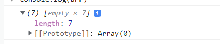
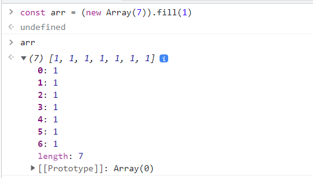
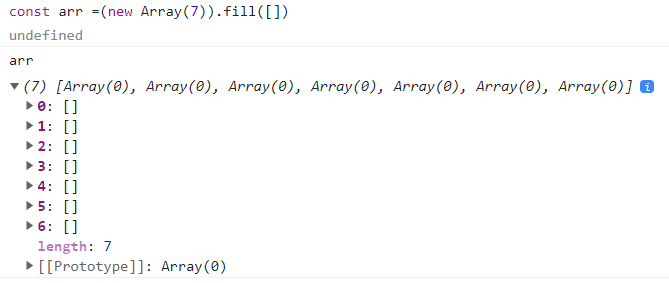
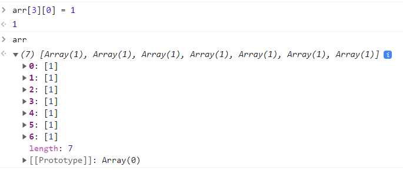

对于前端工程师来说，最关键的是工程能力。

所谓工程能力，本质是“解决问题的能力”，无论是硬编码实力、还是架构思想，其本质都是为了解决问题这个终极目标而服务。

算法训练固然会从一定程度上辅助到你的工程能力（比如提高你代码的严谨度、开拓解决问题的思路等等），但肯定没有直接做工程来得快。

学算法最大的意义仍然是帮你搞定面试、提高你 offer 的 base。

## 数组

在 JavaScript 数据结构中，数组几乎是“基石”一般的存在。

在算法题中，初始化数组时，推荐使用构造函数创建数组来初始化一个空的数组：

```js
const arr = new Array();
```

我们通常需要创造一个指定长度的空数组，需要多长的数组，就给它传多大的参数：

```js
const arr = new Array(7);
```

这样就可以得到一个长度为 7 的数组

在有的场景下，我们需要“创建一个长度确定、同时每一个元素的值也都确定的数组”，这时我们可以调用 fill 方法，假设需求是每个坑里都填上一个 1，只需给它 fill 一个 1：

```js
const arr = new Array(7).fill(1);
```




fill() 方法用一个固定值填充一个数组中从起始索引到终止索引内的全部元素。不包括终止索引。

https://developer.mozilla.org/zh-CN/docs/Web/JavaScript/Reference/Global_Objects/Array/fill

### 遍历数组的三种方法

#### for 循环

```js
// 获取数组的长度
const len = arr.length;
for (let i = 0; i < len; i++) {
  // 输出数组的元素值，输出当前索引
  console.log(arr[i], i);
}
```

#### forEach

```js
arr.forEach((item, index) => {
  // 输出数组的元素值，输出当前索引
  console.log(item, index);
});
```

#### map

map 方法在调用形式上与 forEach 无异，区别在于 map 方法会根据你传入的函数逻辑对数组中每个元素进行处理、进而返回一个全新的数组。

```js
const newArr = arr.map((item, index) => {
  // 输出数组的元素值，输出当前索引
  console.log(item, index);
  // 在当前元素值的基础上加 1
  return item + 1;
});
```

这段代码就通过 map 来返回了一个全新的数组，数组中每个元素的值都是在其现有元素值的基础上+1 后的结果。

从性能上看，for 循环遍历起来是最快的。从语言简洁性来说，如果需要生成一个新的数组使用 map，如果不需要生成新数组可以用 forEach。

### 二维数组

二维数组其实就是数组套数组，也就是每个元素都是数组的数组。代码如下：

```js
// 数组（一维数组）
const arr = [1, 2, 3, 4, 5];

// 二维数组
const arr = [
  [1, 2, 3, 4, 5],
  [1, 2, 3, 4, 5],
  [1, 2, 3, 4, 5],
  [1, 2, 3, 4, 5],
  [1, 2, 3, 4, 5],
];
```

在数学中，形如这样长方阵列排列的复数或实数集合，被称为“矩阵”。因此二维数组的别名也叫“矩阵”。

### 二维数组初始化

#### 错误的方式

我们可以使用下面的代码快速生成一个二维数组，但是会有一个问题。

```js
const arr = new Array(7).fill([]);
```

代码运行结果


问题就是：当我们修改内部某一个数组的值时，会出现一些意向不到的结果，一整列的元素都被设为了 1：

```js
arr[3][0] = 1;
```

代码运行结果


那么，为什么会出现这样的情况呢？

我们给 fill 传递一个入参时，如果这个入参的类型是引用类型，那么 fill 在填充坑位时填充的其实就是入参的引用。

其实这 7 个数组对应了同一个引用、指向的是同一块内存空间，它们本质上是同一个数组。因此当你修改第 3 行第 0 个元素的值时，其余所有行的第 0 个元素的值也都会跟着发生改变。

那么，我们应该怎么样初始化一个二维数组呢？

#### 正确的方式

for 循环中，每一次迭代我们都通过“[]”来创建一个新的数组，这样便不会有引用指向问题带来的尴尬。

```js
const len = arr.length;
for (let i = 0; i < len; i++) {
  // 将数组的每一个坑位初始化为数组
  arr[i] = [];
}
```

### 遍历二维数组

遍历数组（一维数组）需要一次循环，遍历二维数组则需要两次循环。依次类推，N 维数组需要 N 层循环来完成遍历。

```js
// 缓存外部数组的长度
const outerLen = arr.length;
for (let i = 0; i < outerLen; i++) {
  // 缓存内部数组的长度
  const innerLen = arr[i].length;
  for (let j = 0; j < innerLen; j++) {
    // 输出数组的值，输出数组的索引
    console.log(arr[i][j], i, j);
  }
}
```

下面是 JS 中常见的操作数组的 api，因为在下文中会用到，在这里记录一下功能与用法，如果你已经对这些 api 很熟悉了，可以跳过这部分，直接查看栈和队列的部分。

数组中增加元素的三种方法
* unshift 方法-添加元素到数组的头部

```js
const arr = [1, 2];
arr.unshift(0); // [0,1,2]
```

* push 方法-添加元素到数组的尾部

```js
const arr = [1, 2];
arr.push(3); // [1,2,3]
```

* splice 方法-添加元素到数组的任何位置 / 删除数组中任何位置的元素
```js
const arr = [1,2]  
arr.splice(1,0,3) // [1,3,2]
```

[MDN 中关于 splice 方法的描述](https://developer.mozilla.org/zh-CN/docs/Web/JavaScript/Reference/Global_Objects/Array/splice)

### 数组中删除元素的三种方法

* shift 方法-删除数组头部的元素

```js
const arr = [1,2,3]
arr.shift() // [2,3]
```

* pop 方法-删除数组尾部的元素

```js
const arr = [1, 2, 3];
arr.pop(); // [1,2]
```

* 也可以使用 splice 方法
## 数组真题归纳
### 两数求和
> 真题描述： 给定一个整数数组 nums 和一个目标值 target，请你在该数组中找出和为目标值的那 两个 整数，并返回他们的数组下标。
> **你可以假设每种输入只会对应一个答案**。但是，你不能重复利用这个数组中同样的元素。

示例: 给定 nums = [2, 7, 11, 15], target = 9     
因为 nums[0] + nums[1] = 2 + 7 = 9 所以返回 [0, 1]

简单解法：两层循环来遍历同一个数组；第一层循环遍历的值记为 a，第二层循环时遍历的值记为 b；若 a+b = 目标值，那么 a 和 b 对应的数组下标就是我们想要的答案。

大家以后做算法题的时候，要有这样的一种本能：当发现自己的代码里有两层循环时，先反思一下，能不能用空间换时间，把它优化成一层循环。

因为两层循环很多情况下都意味着 O(n^2) 的复杂度，这个复杂度非常容易导致你的算法超时。即便没有超时，在明明有一层遍历解法的情况下，你写了两层遍历，面试官对你的印象分会大打折扣。
#### 空间换时间
大家记住一个结论：几乎所有的求和问题，都可以转化为求差问题。 这道题就是一个典型的例子，通过把求和问题转化为求差问题，事情会变得更加简单。

我们可以在遍历数组的过程中，增加一个 Map 来记录已经遍历过的数字及其对应的索引值。然后每遍历到一个新数字的时候，都回到 Map 里去查询 targetNum 与该数的差值是否已经在前面的数字中出现过了。若出现过，那么答案已然显现，我们就不必再往下走了。

我们以 nums = [2, 7, 11, 15] 这个数组为例，来模拟一下这个思路

键值对存储我们可以用 ES6 里的 Map 来做，如果图省事，直接用对象字面量来定义也没什么问题。

代码实现
```js
const twoSum = function(nums, target) {
    // 这里我用对象来模拟 map 的能力
    const diffs = {}
    // 缓存数组长度
    const len = nums.length
    // 遍历数组
    for(let i=0;i<len;i++) {
        // 判断当前值对应的 target 差值是否存在（是否已遍历过）
        if(diffs[target-nums[i]]!==undefined) {
            // 若有对应差值，那么答案get！
            return [diffs[target - nums[i]], i]
        }
        // 若没有对应差值，则记录当前值
        diffs[nums[i]]=i
    }
};
```
使用ES6中Map的方法
```js
var twoSum = function(nums, target) {
    // 拿到数组长度
    let numsLen = nums.length
    // 创建一个Map对象
    const map =new Map()
 for(let i =0; i<numsLen;i++){
    //  拿到目标值与当前数组相减的值
     let a = target-nums[i]
 
    //  判断map里是否存在这个值，存在的话进入循环
     if(map.has(a)){
        // 获取对应的值和键 返回结果
         return [map.get(a),i]
     }
        //  把我们当前数组的值和键存储在map里面
         map.set(nums[i],i)
 }
 return []
};
```
### 双指针法
合并两个有序数组

真题描述：给你两个有序整数数组 nums1 和 nums2，请你将 nums2 合并到 nums1 中，使 nums1 成为一个有序数组。

说明: 初始化 nums1 和 nums2 的元素数量分别为 m 和 n 。 你可以假设 nums1 有足够的空间（空间大小大于或等于 m + n）来保存 nums2 中的元素。

示例: 输入:
nums1 = [1,2,3,0,0,0], m = 3
nums2 = [2,5,6], n = 3
输出: [1,2,2,3,5,6]
首先我们定义两个指针，各指向两个数组生效部分的尾部：
每次只对指针所指的元素进行比较。取其中较大的元素，把它从 nums1 的末尾往前面填补：
这里有一点需要解释一下：
为什么是从后往前填补？因为是要把所有的值合并到 nums1 里，所以说我们这里可以把 nums1 看做是一个“容器”。但是这个容器，它不是空的，而是前面几个坑有内容的。如果我们从前往后填补，就没法直接往对应的坑位赋值了（会产生值覆盖）。
从后往前填补，我们填的都是没有内容的坑，这样会省掉很多麻烦。
由于 nums1 的有效部分和 nums2 并不一定是一样长的。我们还需要考虑其中一个提前到头的这种情况：
1. 如果提前遍历完的是 nums1 的有效部分，剩下的是 nums2。那么这时意味着 nums1 的头部空出来了，直接把 nums2 整个补到 nums1 前面去即可。
2. 如果提前遍历完的是 nums2，剩下的是 nums1。由于容器本身就是 nums1，所以此时不必做任何额外的操作。
```js
const merge = function(nums1, m, nums2, n) {
    // 初始化两个指针的指向，初始化 nums1 尾部索引k
    let i = m - 1, j = n - 1, k = m + n - 1
    // 当两个数组都没遍历完时，指针同步移动
    while(i >= 0 && j >= 0) {
        // 取较大的值，从末尾往前填补
        if(nums1[i] >= nums2[j]) {
            nums1[k] = nums1[i] 
            i-- 
            k--
        } else {
            nums1[k] = nums2[j] 
            j-- 
            k--
        }
    }
    
    // nums2 留下的情况，特殊处理一下 
    while(j>=0) {
        nums1[k] = nums2[j]  
        k-- 
        j--
    }
};
```
### 三数求和
真题描述：给你一个包含 n 个整数的数组 nums，判断 nums 中是否存在三个元素 a，b，c ，使得 a + b + c = 0 ？请你找出所有满足条件且不重复的三元组。

注意：答案中不可以包含重复的三元组。

示例： 给定数组 nums = [-1, 0, 1, 2, -1, -4]， 满足要求的三元组集合为： [ [-1, 0, 1], [-1, -1, 2] ]
（这里大家相信已经能察觉出来双指针法的使用场景了，一方面，它可以做到空间换时间；另一方面，它也可以帮我们降低问题的复杂度。）

双指针法用在涉及求和、比大小类的数组题目里时，大前提往往是：该数组必须有序。否则双指针根本无法帮助我们缩小定位的范围，压根没有意义。因此这道题的第一步是将数组排序：
```js
 nums = nums.sort((a,b)=>{
    return a-b
})
```
然后，对数组进行遍历，每次遍历到哪个数字，就固定哪个数字。然后把左指针指向该数字后面一个坑里的数字，把右指针指向数组末尾，让左右指针从起点开始，向中间前进：

每次指针移动一次位置，就计算一下两个指针指向数字之和加上固定的那个数之后，是否等于0。如果是，那么我们就得到了一个目标组合；否则，分两种情况来看：

* 相加之和大于0，说明右侧的数偏大了，右指针左移
* 相加之和小于0，说明左侧的数偏小了，左指针右移
  
tips：这个数组在题目中要求了“不重复的三元组”，因此我们还需要做一个重复元素的跳过处理。这一点在编码实现环节大家会注意到。
```js
/**
 * @param {number[]} nums
 * @return {number[][]}
 */
const threeSum = function(nums) {
    // 用于存放结果数组
    let res = [] 
    // 给 nums 排序
    nums = nums.sort((a,b)=>{
        return a-b
    })
    // 缓存数组长度
    const len = nums.length
    // 注意我们遍历到倒数第三个数就足够了，因为左右指针会遍历后面两个数
    for(let i=0;i<len-2;i++) {
        // 左指针 j
        let j=i+1 
        // 右指针k
        let k=len-1   
        // 如果遇到重复的数字，则跳过
        if(i>0&&nums[i]===nums[i-1]) {
            continue
        }
        while(j<k) {
            // 三数之和小于0，左指针前进
            if(nums[i]+nums[j]+nums[k]<0){
                j++
               // 处理左指针元素重复的情况
               while(j<k&&nums[j]===nums[j-1]) {
                    j++
                }
            } else if(nums[i]+nums[j]+nums[k]>0){
                // 三数之和大于0，右指针后退
                k--
               
               // 处理右指针元素重复的情况
               while(j<k&&nums[k]===nums[k+1]) {
                    k--
                }
            } else {
                // 得到目标数字组合，推入结果数组
                res.push([nums[i],nums[j],nums[k]])
                
                // 左右指针一起前进
                j++  
                k--
               
                // 若左指针元素重复，跳过
                while(j<k&&nums[j]===nums[j-1]) {
                    j++
                }  
               
               // 若右指针元素重复，跳过
               while(j<k&&nums[k]===nums[k+1]) {
                    k--
                }
            }
        }
    }
    
    // 返回结果数组
    return res
};
```

### 双指针法中的对撞指针法
左右指针一起从两边往中间位置相互迫近，这样的特殊双指针形态，被称为“对撞指针”。

对撞指针可以帮助我们缩小问题的范围，这一点在“三数求和”问题中体现得淋漓尽致：因为数组有序，所以我们可以用两个指针“画地为牢”圈出一个范围，这个范围以外的值不是太大就是太小、直接被排除在我们的判断逻辑之外，这样我们就可以把时间花在真正有意义的计算和对比上。如此一来，不仅节省了计算的时间，更降低了问题本身的复杂度，我们做题的速度也会大大加快。
## 栈和队列

在 JavaScript 中，栈和队列的实现一般都要依赖于数组，大家完全可以把栈和队列都看作是“特别的数组”。

栈和队列作为两种运算受限的线性表，用链表来实现也是没问题的。只是从前端面试做题的角度来说，链表实现起来会比数组麻烦得多，做不到开箱即用），基本没人会这么干。

两者的区别在于，它们各自对数组的增删操作有着不一样的限制。

### 栈（Stack）——只用 pop 和 push 完成增删的“数组”

栈是一种后进先出(LIFO，Last In First Out)的数据结构。

> 后进先出：越是后来放进去的，越是先被取出来；越是先放进去的，越是最后被取出来。

栈的特点是只能从尾部添加/取出元素：对应到数组的方法就是 push 和 pop。因此，我们可以认为在 JavaScript 中，栈就是限制只能用 push 来添加元素，同时只能用 pop 来移除元素的一种特殊的数组。

在面试算法中会有获取栈顶元素的题目，所谓栈顶元素，实际上指的就是数组尾部的元素。

```js
// 初始状态，栈空
const stack = [];
// 入栈过程
stack.push("东北大板");
stack.push("可爱多");
stack.push("巧乐兹");
stack.push("冰工厂");
stack.push("光明奶砖");

// 出栈过程，栈不为空时才执行
while (stack.length) {
  // 单纯访问栈顶元素（不出栈）
  const top = stack[stack.length - 1];
  console.log("现在取出的冰淇淋是", top);
  // 将栈顶元素出栈
  stack.pop();
}

// 栈空
stack; // []
```

### 队列

队列是一种先进先出（FIFO，First In First Out）的数据结构。这个过程类似于我们去餐馆吃饭，先点餐的人先出餐，后点餐的人后出餐。

队列的特点是从尾部添加元素，从头部取出元素。对应到数组的方法就是 push 和 shift。
在栈元素出栈时，我们关心的是栈顶元素（数组的最后一个元素）；队列元素出队时，我们关心的则是队头元素（数组的第一个元素）。

下面是基于数组实现队列的常用操作，先添加元素，然后取出元素：

```js
const queue = [];
queue.push("小册一姐");
queue.push("小册二姐");
queue.push("小册三姐");

while (queue.length) {
  // 单纯访问队头元素（不出队）
  const top = queue[0];
  console.log(top, "取餐");
  // 将队头元素出队
  queue.shift();
}

// 队空
queue; // []
```
