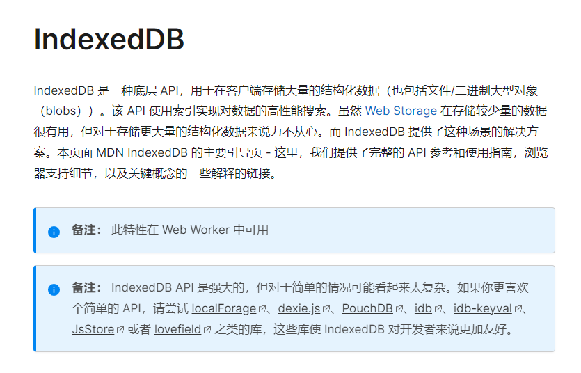

## 前言

localStorage 是前端本地存储的一种方式，容量在 5M ~ 10M，可以用来缓存一些简单的数据

但是如果需要存储大量的本地数据，localStorage 就不够用了。当然，浏览器也提供了存储大量本地数据的解决方案，如：[IndexedDB](https://developer.mozilla.org/zh-CN/docs/Web/API/IndexedDB_API)。




查看了 MDN 文档，IndexedDB 的功能十分强大， 但直接使用太复杂。所以我们去用一下 MDN 推荐的库：localForage 和 idb-keyval 。

## [localForage](http://localforage.docschina.org/#localforage)

官网链接：https://localforage.github.io/localForage/#localforage

代码示例：https://github.com/MambaNeverOut/localForage-and-idb-keyval

localForage 拥有与 localStorage 类似的 API，和localStorage 不同的地方在于：方式为异步存储，并且能存储多种类型的数据。   

下面是 localForage 可以存储的数据类型：
* Array
* ArrayBuffer
* Blob
* Float32Array
* Float64Array
* Int8Array
* Int16Array
* Int32Array
* Number
* Object
* Uint8Array
* Uint8ClampedArray
* Uint16Array
* Uint32Array
* String
  
> localForage 有一个优雅降级策略，若浏览器不支持 IndexedDB 或 WebSQL，则使用 localStorage。在所有主流浏览器中都可用：Chrome，Firefox，IE 和 Safari（包括 Safari Mobile）。

localForage 可以通过回调方式使用，同时也支持 ES6 Promises 的调用方式。

### 安装和引入

```js
// 通过 npm 安装：
npm install localforage

// 通过 bower：
bower install localforage

<script src="localforage.js"></script>
<script>console.log('localforage is: ', localforage);</script>
```

### 存储和读取

localForage 在存储和读取时使用的API几乎完全相同，下面是这几个API的示例。
#### getItem(key, successCallback)  获取存储中 key 对应的的数据

示例：
```js
localforage.getItem('somekey').then(function(value) {
    // 当离线仓库中的值被载入时，此处代码运行
    console.log(value);
}).catch(function(err) {
    // 当出错时，此处代码运行
    console.log(err);
});

// 回调版本：
localforage.getItem('somekey', function(err, value) {
    // 当离线仓库中的值被载入时，此处代码运行
    console.log(value);
});
```
> 当存储 undefined 时， getItem() 也会返回 null。[由于 localStorage 限制](https://github.com/localForage/localForage/pull/42)，同时出于兼容性的原因 localForage 无法存储 undefined。


* localForage 存储 undefined，会返回 null
* localStorage 存储 undefined，会报错 ERROR : JSON.parse("undefined")
* WebSQL 存储 undefined，会返回 "undefined" （字符串形式的 undefined)
  
#### setItem(key, value, successCallback)  把数据添加到存储中，并为其设置 key

```js
localforage.setItem('somekey', 'some value').then(function (value) {
    // 当值被存储后，可执行其他操作
    console.log(value);
}).catch(function(err) {
    // 当出错时，此处代码运行
    console.log(err);
});

// 不同于 localStorage，你可以存储非字符串类型
localforage.setItem('my array', [1, 2, 'three']).then(function(value) {
    // 如下输出 `1`
    console.log(value[0]);
}).catch(function(err) {
    // 当出错时，此处代码运行
    console.log(err);
});

// 你甚至可以存储 AJAX 响应返回的二进制数据
req = new XMLHttpRequest();
req.open('GET', '/photo.jpg', true);
req.responseType = 'arraybuffer';

req.addEventListener('readystatechange', function() {
    if (req.readyState === 4) { // readyState 完成
        localforage.setItem('photo', req.response).then(function(image) {
            // 如下为一个合法的  标签的 blob URI
            var blob = new Blob([image]);
            var imageURI = window.URL.createObjectURL(blob);
        }).catch(function(err) {
          // 当出错时，此处代码运行
          console.log(err);
        });
    }
});
```
> 当使用 localStorage 和 WebSQL 作为后端时，二进制数据在保存（和检索）之前会被序列化。在保存二进制数据时，序列化会导致大小增大。

#### removeItem(key, successCallback) 从存储中删除 key 对应的数据

示例：
```js
localforage.removeItem('somekey').then(function() {
    // 当值被移除后，此处代码运行
    console.log('Key is cleared!');
}).catch(function(err) {
    // 当出错时，此处代码运行
    console.log(err);
});
```

#### clear(successCallback)  删除存储中所有的数据（谨慎使用）

```js
localforage.clear().then(function() {
    // 当数据库被全部删除后，此处代码运行
    console.log('Database is now empty.');
}).catch(function(err) {
    // 当出错时，此处代码运行
    console.log(err);
});
```
#### length(successCallback) 获取存储中数据（key）的数量

```js
localforage.length().then(function(numberOfKeys) {
    // 输出数据库的大小
    console.log(numberOfKeys);
}).catch(function(err) {
    // 当出错时，此处代码运行
    console.log(err);
});
```

#### key(keyIndex, successCallback) 根据 key 的索引获取 key的名称
> 这个 API 是从 localStorage 延续而来的
```js
localforage.key(2).then(function(keyName) {
    // key 名
    console.log(keyName);
}).catch(function(err) {
    // 当出错时，此处代码运行
    console.log(err);
});
```

#### keys(successCallback) 获取存储中所有的 key

```js
localforage.keys().then(function(keys) {
    // 包含所有 key 名的数组
    console.log(keys);
}).catch(function(err) {
    // 当出错时，此处代码运行
    console.log(err);
});
```
#### iterate(iteratorCallback, successCallback) 迭代存储中所有的key和数据
iteratorCallback：迭代时执行的回调函数，有三个参数：
1. value key 对应的值，
2. key 键名（存储时传入的 key）
3. iterationNumber 迭代索引 

```js
// 同样的代码，但使用 ES6 Promises
localforage.iterate(function(value, key, iterationNumber) {
    // 此回调函数将对所有 key/value 键值对运行
    console.log([key, value]);
}).then(function() {
    console.log('Iteration has completed');
}).catch(function(err) {
    // 当出错时，此处代码运行
    console.log(err);
});

// 提前退出迭代：
localforage.iterate(function(value, key, iterationNumber) {
    if (iterationNumber < 3) {
        console.log([key, value]);
    } else {
        return [key, value];
    }
}).then(function(result) {
    console.log('Iteration has completed, last iterated pair:');
    console.log(result);
}).catch(function(err) {
    // 当出错时，此处代码运行
    console.log(err);
});
```

通过在 iteratorCallback 回调函数中返回一个非 undefined 的值，能提前退出 iterate。iteratorCallback 的返回值即作为整个迭代的结果，将被传入 successCallback。

### 设置

localForage 还支持设置使用指定的数据库
#### setDriver(driverName)  或 setDriver([driverName, nextDriverName])

localForage 默认会按照下面的顺序选择数据存储的数据库系统：

* IndexedDB
* WebSQL
* localStorage
  
可以使用 setDriver() 强制使用特定的驱动，参数可以是一个或多个：

* localforage.INDEXEDDB
* localforage.WEBSQL
* localforage.LOCALSTORAGE

```js
// 强制设置 localStorage 为后端的驱动
localforage.setDriver(localforage.LOCALSTORAGE);

// 列出可选的驱动，以优先级排序
localforage.setDriver([localforage.WEBSQL, localforage.INDEXEDDB]);
```

#### config(options)设置 localForage 选项

> 这个 config 方法是同步的
 
在调用 localForage 前必先调用它，但可以在 localForage 被加载后调用。使用此方法设置的任何配置值都将保留，即使在驱动更改后，所以你也可以先调用 config() 再次调用 setDriver()。

参数有下面六个：

* driver
要使用的首选驱动。与上面的 setDriver 的值格式相同。
默认值：`[localforage.INDEXEDDB, localforage.WEBSQL, localforage.LOCALSTORAGE]`

* name
数据库的名称。通常会使用你的应用程序的名字。在 localStorage 中，它作为存储在 localStorage 中的所有 key 的前缀。
默认值：'localforage'

* size
数据库的大小（以字节为单位）。现在只用于WebSQL。 默认值：4980736

* storeName
数据仓库的名称。在 IndexedDB 中为 dataStore，在 WebSQL 中为数据库 key/value 键值表的名称。仅含字母和数字和下划线。任何非字母和数字字符都将转换为下划线。
默认值：'keyvaluepairs'

* version

[!中文版本](../../.vuepress/public/browser/version_cn.jpg)


因为我英文水平一般，所以看得是中文文档，中文介绍是上面这样的，我看不懂`目前未使用`是什么意思，于是我特地去查看了英文文档。
  
[!英文版本](../../.vuepress/public/browser/version_en.jpg)


我去翻译软件翻译了一下，结果放在了下面：
```
数据库的版本。只在WebSQL和IndexedDB中使用。在WebSQL中，这只是设置版本，而在IndexedDB中，如果检测到版本升级，这可能会触发onupgradeneed事件。如果检测到一个新的存储，localForage 将要求IndexedDB增加版本本身，以手动触发onupgradeneed事件。到目前为止，升级事件还不能自定义，但将来可能会这样。对于不支持版本控制配置的驱动程序，此值将被丢弃。
```

> 中文版本说明了重要信息，但不看英文版本我不太明白它表达的是什么意思。推荐大家有条件还是看英文文档吧


* description
数据库的描述。默认值：''

```js
// 将数据库从 “localforage” 重命名为 “Hipster PDA App”
localforage.config({
    name: 'Hipster PDA App'
});

// 将强制使用 localStorage 作为存储驱动，即使其他驱动可用。
// 可用配置代替 `setDriver()`。
localforage.config({
    driver: localforage.LOCALSTORAGE,
    name: 'I-heart-localStorage'
});

// 配置不同的驱动优先级
localforage.config({
    driver: [localforage.WEBSQL,
             localforage.INDEXEDDB,
             localforage.LOCALSTORAGE],
    name: 'WebSQL-Rox'
});
```

### 驱动

#### defineDriver
你需要确保接受一个 callback 参数，并且将同样的几个参数传递给回调函数，类似默认驱动那样。同时你还需要 resolve 或 reject 进行处理。通过 默认驱动 可了解如何实现自定义的驱动。

自定义实现可包含一个 _support 属性，该属性为布尔值（true / false），或者返回一个 Promise，该 Promise 的结果为布尔值。如果省略 _support，则默认值是 true 。可以用它来标识当前的浏览器支持你自定义的驱动。
```js
// 此处为驱动的实现
var myCustomDriver = {
    _driver: 'customDriverUniqueName',
    _initStorage: function(options) {
        // 在此处自定义实现...
    },
    clear: function(callback) {
        // 在此处自定义实现...
    },
    getItem: function(key, callback) {
        // 在此处自定义实现...
    },
    key: function(n, callback) {
        // 在此处自定义实现...
    },
    keys: function(callback) {
        // 在此处自定义实现...
    },
    length: function(callback) {
        // 在此处自定义实现...
    },
    removeItem: function(key, callback) {
        // 在此处自定义实现...
    },
    setItem: function(key, value, callback) {
        // 在此处自定义实现...
    }
}

// 为 localForage 添加驱动。
localforage.defineDriver(myCustomDriver);
```

> 在任何一个 localForage 实例上添加驱动实现后，则该驱动可用于页面内的所有 localForage 实例。

#### driver()

返回正在使用的驱动的名称，在异步的驱动初始化过程中为 null，如果初始化结束后未能找到可用的驱动也为 null。

```js
localforage.driver();
// "asyncStorage"
```
> 如果驱动在初始化过程中或之后出错，localForage 将试着使用下一个驱动。由加载 localForage 时的默认驱动顺序或传递给 setDriver() 的驱动顺序决定。

#### ready

ready() 确定异步驱动程序初始化过程是否已完成，使用这个方法我们可以知道 localForage 当前正在使用的是哪一个驱动。
```js
localforage.ready().then(function() {
    // 当 localforage 将指定驱动初始化完成时，此处代码运行
    console.log(localforage.driver()); // LocalStorage
}).catch(function (e) {
    console.log(e); // `No available storage method found.`
    // 当没有可用的驱动时，`ready()` 将会失败
});
```
#### supports(driverName)

返回一个布尔值，表示浏览器是否支持 driverName。

```js
localforage.supports(localforage.INDEXEDDB);
// true
```
### 多实例
可以创建多个 localForage 实例，且能指向不同数据库。所有 config 中的配置选项都可用。

#### createInstance
创建并返回一个 localForage 的新实例。每个实例对象都有独立的数据库，而不会影响到其他实例。

```js
var store = localforage.createInstance({
  name: "nameHere"
});

var otherStore = localforage.createInstance({
  name: "otherName"
});

// 设置某个数据仓库 key 的值不会影响到另一个数据仓库
store.setItem("key", "value");
otherStore.setItem("key", "value2");
```

#### dropInstance

当不带参数调用时，它将丢弃当前实例的所有 store（存储空间）。当使用同时指定name和storeName属性的对象调用时，它会删除指定的 store（存储空间）。当使用只指定name属性的对象调用时，它会删除指定的数据库(及其所有存储)。

```js
localforage.dropInstance().then(function() {
  console.log('Dropped the store of the current instance');
});

localforage.dropInstance({
  name: "otherName",
  storeName: "otherStore"
}).then(function() {
  console.log('Dropped otherStore').
});

localforage.dropInstance({
  name: "otherName"
}).then(function() {
  console.log('Dropped otherName database').
});
```
### 多个 store（存储空间）
还可以创建指向同一个实例的多个存储容器。
> 可以理解为在一个数据库里，可以新建多个表

```js
const dbName = 'databaseName';

// Create table 1 in databaseName
var tableOne = localforage.createInstance({
    name        : dbName,
    storeName   : 'tableOne',
    description : '...'
});

// Create table 2 in databaseName
var tableTwo = localforage.createInstance({
    name        : dbName,
    storeName   : 'tableTwo',
    description : '...'
});
```

## 总结

阅读完文档以后，感觉设计思路和数据库十分相似，怪不得会叫做 WebSQL，无论是设计思路还是命名都很像 MySQL。

大多数情况下，localForage 的存储和读取，还有设置部分的API就可以满足我们的需求了。但是 localForage 也提供了更高级的功能来，方便我们在开发时对存储空间进行合理有效的管理，大家在使用时酌情选择。

